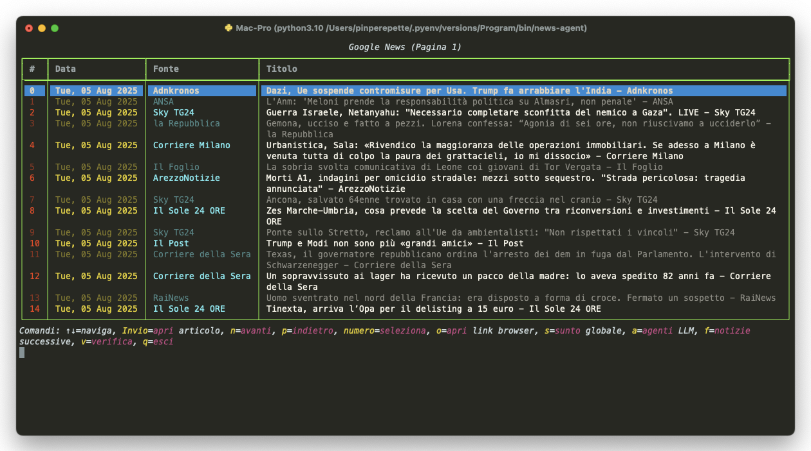
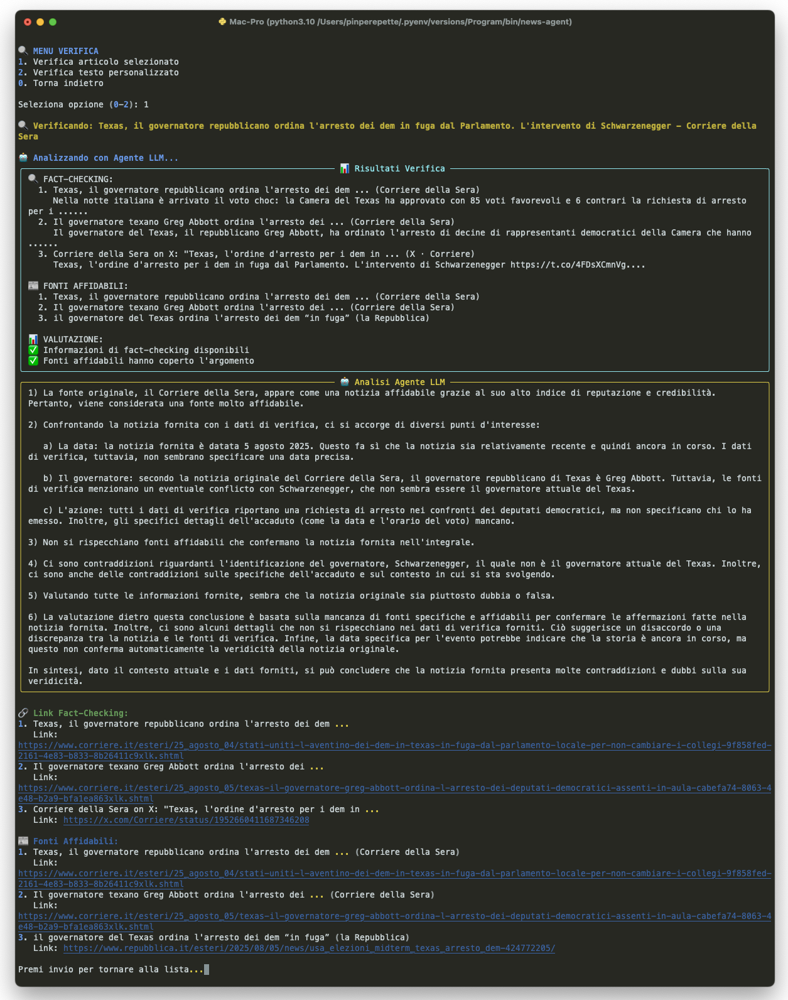

# 🚀 News Agent Pro

**Advanced AI-Powered News Analysis & Fact-Checking System**

[](https://python.org)
[](https://rich.readthedocs.io)
[](https://openai.com)

## 🚀 **Key Features**

### 🧠 **Intelligent Critical Analysis**
- **🔬 Scientific Agent**: Evaluates research methodology and scientific rigor
- **🏛️ Political Agent**: Analyzes political statements and government sources
- **💻 Technology Agent**: Verifies tech announcements and innovations
- **💰 Economic Agent**: Checks financial data and economic reports
- **🌍 Universal Agent**: General fact-checking and cross-verification

### 🎯 **Multi-Agent Orchestration**
- **Intelligent Routing**: AI automatically selects the most appropriate agents
- **Collaborative Verification**: Multiple agents work together for comprehensive analysis
- **Domain Detection**: Automatic classification of news by topic
- **Specialized Evaluation**: Each agent uses domain-specific criteria

### 🌍 **Multilingual Support**
- **Flexible Sources**: Select news sources from any language
- **Customizable Output**: Receive results in your preferred language
- **Automatic Language Detection**: Smart language recognition
- **Intelligent Translation**: Seamless cross-language analysis

### 📊 **Advanced Analytics & Tracking**
- **SQLite Database**: Complete session and performance tracking
- **Detailed Statistics**: Per-session and global analytics
- **Customizable Reports**: Data export and analysis
- **Real-time Monitoring**: Performance tracking

### 🎨 **Modern Rich Interface**
- **Beautiful UI**: Rich colors and animations
- **Interactive Dashboard**: Real-time statistics
- **Progress Indicators**: Visual feedback for long operations
- **Keyboard Navigation**: Intuitive shortcuts and controls

### 🔍 **Advanced News Verification System**
- **Real news from Google News** in real-time (via RSS, no sketchy scraping)
- **Interactive terminal table** with keyboard navigation, Rich styling, and focus highlight
- **Multiple AI Providers**: Support for Ollama (local), OpenAI, and Claude
- **Chained LLM agents:**
  - *Summary Agent*: concise, factual abstract
  - *Implications Agent*: in-depth analysis of consequences
  - *Theory Agent*: connects dots and builds scenarios
  - *Universal Analysis Agent*: multi-thematic framework for complex topics
  - *(All agents can be triggered from the terminal UI!)*
- **🔍 Advanced News Verification System** (with SerpAPI):
  - Verify selected articles or custom text
  - **Three verification modes**: Fast, Medium, Comprehensive
  - **Standard and Advanced verification** with step-by-step reasoning
  - Fact-checking search results with full content scraping
  - **Bilingual search** (Italian + English sources)
  - Reliable sources cross-reference
  - AI-powered truth analysis with critical skepticism
  - **Direct truth validation** with clear verdicts (VERA/FALSA/DUBBIA)
- **⚙️ Built-in Settings Manager**: Modify all configuration directly from UI
- **Full article content scraping** for comprehensive analysis
- **Open article in browser** with one key
- **Multi-language** and Google News topic filtering (configurable in settings)
- **No cloud required:**
  - 100% local processing with Ollama, no external APIs needed
  - Cloud options available for higher quality analysis
- **Designed for hacking/extending:** config/code separation, easy to customize
- **Works on Linux, macOS, WSL, Windows Terminal**

## 📦 **Installation**




---

## ⚡ Installation

Clone the repo and install locally:

```bash
git clone https://github.com/Pinperepette/news_agent.git
cd news_agent
pip install .

news-agent
```

## 🔧 Configuration
```bash
# Clone the repository
git clone <repository-url>
cd news_agent

# Install dependencies
pip install -e .

# Configure API keys
cp settings.ini.example settings.ini
# Edit settings.ini with your API keys

# Start the application
python -m news_agent.main
```

### Windows Installation
For detailed Windows installation instructions, see [WINDOWS_INSTALL.md](WINDOWS_INSTALL.md)

## 🔑 **API Keys Setup**

### **🤖 AI Providers**

#### **OpenAI (Paid - Cloud)**
1. **Get API Key**: Go to [platform.openai.com](https://platform.openai.com)
2. **Sign up/Login**: Create account or login
3. **Add Payment Method**: Credit card required
4. **Get API Key**: Go to "API Keys" → "Create new secret key"
5. **Configure**:
   ```ini
   [AI]
   provider = openai
   openai_api_key = sk-your-key-here
   openai_model = gpt-4
   ```

#### **Claude (Paid - Cloud)**
1. **Get API Key**: Go to [console.anthropic.com](https://console.anthropic.com)
2. **Sign up/Login**: Create account or login
3. **Add Payment Method**: Credit card required
4. **Get API Key**: Go to "API Keys" → "Create key"
5. **Configure**:
   ```ini
   [AI]
   provider = claude
   claude_api_key = sk-ant-your-key-here
   claude_model = claude-3-sonnet-20240229
   ```
3. Run: `python -m news_agent.main`

#### **Ollama (Free - Local)**
1. **Install Ollama**: 
   - **macOS/Linux**: `curl -fsSL https://ollama.ai/install.sh | sh`
   - **Windows**: Download from [ollama.ai](https://ollama.ai)
2. **Start Ollama**: `ollama serve`
3. **Download Model**: `ollama pull qwen2:7b-instruct`
4. **Configure**:
   ```ini
   [AI]
   provider = ollama
   model = qwen2:7b-instruct
   ```
4. Run: `python -m news_agent.main`

### **🔍 News Verification APIs (Optional)**

#### **SerpAPI (Paid - Web Search)**
1. **Get API Key**: Go to [serpapi.com](https://serpapi.com)
2. **Sign up**: Create account
3. **Add Payment Method**: Credit card required
4. **Get API Key**: Dashboard → "API Key"
5. **Configure**:
   ```ini
   [News]
   serpapi_key = your-serpapi-key
   ```

#### **ScrapingDog (Paid - Content Extraction)**
1. **Get API Key**: Go to [scrapingdog.com](https://scrapingdog.com)
2. **Sign up**: Create account
3. **Add Payment Method**: Credit card required
4. **Get API Key**: Dashboard → "API Key"
5. **Configure**:
   ```ini
   [News]
   scrapingdog_api_key = your-scrapingdog-key
   ```

### **💰 Pricing Information**

#### **OpenAI**
- **GPT-4**: ~$0.03 per 1K tokens
- **GPT-3.5**: ~$0.002 per 1K tokens
- **Free Tier**: $5 credit for new users

#### **Claude**
- **Claude 3 Sonnet**: ~$0.015 per 1K tokens
- **Claude 3 Haiku**: ~$0.0025 per 1K tokens
- **Free Tier**: $5 credit for new users

#### **SerpAPI**
- **Starter**: $50/month for 5,000 searches
- **Basic**: $100/month for 12,500 searches
- **Pro**: $250/month for 35,000 searches

#### **ScrapingDog**
- **Starter**: $29/month for 1,000 requests
- **Basic**: $99/month for 5,000 requests
- **Pro**: $299/month for 20,000 requests

#### **Ollama**
- **Free**: No cost, runs locally
- **Hardware**: Requires 8GB+ RAM for good performance

### **⚙️ Complete Configuration Example**

```ini
[AI]
provider = openai
openai_api_key = sk-your-openai-key-here
openai_model = gpt-4

[News]
serpapi_key = your-serpapi-key
scrapingdog_api_key = your-scrapingdog-key

[General]
default_language = en
articles_per_page = 15
search_timeout = 30
enable_analytics = true
```

## 🎯 **How to Use**

### 🚀 **Quick Mode**
1. Launch the application
2. Select "Quick Mode"
3. System automatically analyzes predefined sources
4. Receive results in your preferred language

### 🔍 **Custom Analysis**
1. **Select Sources**: Choose from multiple languages
2. **Choose Output Language**: Independent of source language
3. **Critical Analysis**: AI analyzes like an expert
4. **Detailed Results**: Plausibility assessment and suspicious points

### 📝 **Manual Analysis**
1. Enter article title and content
2. System automatically detects language
3. Receive complete critical analysis
4. Strategic queries for verification

## 🤖 **AI Agents Overview**

### 🔬 **Scientific Agent**
- **Purpose**: Evaluates research methodology and scientific studies
- **Focus**: 
  - Access to original data vs. reconstructions
  - Experimental protocol rigor
  - Instrumentation quality
  - Peer review status
  - Replicability of methods
- **Icon**: 🔬

### 🏛️ **Political Agent**
- **Purpose**: Analyzes political statements and government sources
- **Focus**:
  - Official declarations
  - Government communications
  - Political party statements
  - Institutional sources
- **Icon**: 🏛️

### 💻 **Technology Agent**
- **Purpose**: Verifies tech announcements and innovations
- **Focus**:
  - Official company announcements
  - Patent information
  - Technical documentation
  - Industry expert opinions
- **Icon**: 💻

### 💰 **Economic Agent**
- **Purpose**: Checks financial data and economic reports
- **Focus**:
  - Official financial reports
  - Economic indicators
  - Market data
  - Expert economic analysis
- **Icon**: 💰

### 🌍 **Universal Agent**
- **Purpose**: General fact-checking and cross-verification
- **Focus**:
  - Multiple source verification
  - Cross-reference checking
  - General credibility assessment
- **Icon**: 🌍

## 🌍 **Supported Sources**

### 🇮🇹 **Italian**
- ANSA
- Repubblica
- Corriere della Sera
- Il Sole 24 Ore
- La Stampa

### 🇺🇸 **English**
- Reuters
- BBC News
- CNN
- TechCrunch
- Wired
- The Verge

### 🇫🇷 **French**
- Le Monde
- Le Figaro
- Les Echos
- L'Express

### 🇪🇸 **Spanish**
- El País
- El Mundo
- ABC
- La Vanguardia

### 🇩🇪 **German**
- Der Spiegel
- Die Zeit
- Süddeutsche Zeitung
- Frankfurter Allgemeine

## 🎮 **Navigation & Controls**

### **Main Menu**
- **Arrow Keys**: Navigate between options
- **Enter**: Select option
- **q**: Quit application

### **Article List**
- **↑↓**: Navigate articles
- **Enter**: Open selected article
- **n**: Next page
- **p**: Previous page
- **o**: Open article in browser
- **v**: Critical analysis
- **c**: Configuration
- **q**: Quit

### **Analysis Mode**
- **1**: Analyze selected article
- **2**: Custom text analysis
- **3**: URL analysis
- **0**: Back to main menu

### **LLM Agents Menu (a)**
1. **Summary**: Quick factual summary using full article content
2. **Implications**: Social, economic, political consequences
3. **Theory/Scenario**: Complex scenarios and connections
4. **Universal Analysis**: Multi-thematic framework for complex topics
5. **All Agents**: Run all agents in sequence

## ⚙️ **Configuration**

### **AI Provider Settings**
- **Ollama** (Local - no internet required)
- **OpenAI** (GPT-4/GPT-3.5)
- **Claude** (Anthropic)
- **Auto** (Automatic fallback)

### **API Keys**
- OpenAI API Key
- Claude API Key
- SerpAPI Key (for web search)
- ScrapingDog API Key (for content extraction)

### **General Settings**
- Default language
- Number of results per page
- Search timeout
- Cache settings

### **📰 SELECTED ARTICLE:**
1. **Standard Verification**: Basic critical analysis of selected article
2. **Standard Truth Validation**: Direct truth validation with confidence level
3. **Multi-Agent System** 🤖: **NEW** - Complete analysis with 6 specialized agents

### **📝 CUSTOM TEXT:**
4. **Standard Verification**: Basic critical analysis of custom text
5. **Advanced Verification (Step-by-Step)**: Detailed analysis with structured reasoning
6. **Advanced Truth Validation**: Advanced truth validation with complex analysis

### **🤖 Multi-Agent System (Option 3):**
The most comprehensive verification system using 6 specialized agents:

- **🔍 Investigator Agent**: Finds and collects key information
- **📊 Methodological Analyst Agent**: Evaluates scientific studies
- **🎯 Verifier Agent**: Checks specific facts
- **⚖️ Judge Agent**: Analyzes bias and conflicts of interest
- **🌐 Consensus Agent**: Analyzes scientific consensus
- **🧠 Synthesizer Agent**: Combines all results for final verdict

### **⚡ Verification Modes:**
- **Fast** (~30 sec): Quick fact-checking, basic sources, Italian only
- **Medium** (~2 min): Balanced approach, bilingual sources, full scraping
- **Comprehensive** (~5 min): Comprehensive analysis, complete bilingual sources

## 🔧 **Technical Architecture**

### **Core Components**
- **Critical Analyst**: Main analysis engine
- **Intelligent Orchestrator**: Agent selection and coordination
- **Specialized Agents**: Domain-specific analysis
- **Multilingual System**: Language handling
- **Rich UI**: User interface

### **Data Flow**
1. **Input**: Article or text
2. **Analysis**: Critical assessment
3. **Routing**: Agent selection
4. **Verification**: Multi-source checking
5. **Evaluation**: Final assessment
6. **Output**: Detailed report

## 📊 **Analytics & Reports**

### **Session Tracking**
- Articles analyzed
- Sources used
- Analysis time
- Agent performance

### **Global Statistics**
- Total articles processed
- Success rate
- Most used sources
- Performance trends

### **Export Options**
- CSV reports
- JSON data
- Custom formats

## 🛠️ **Development**

### **Project Structure**
```
news_agent/
├── news_agent/
│   ├── main.py                 # Main application
│   ├── critical_analyst.py     # Critical analysis logic
│   ├── intelligent_orchestrator.py  # Agent coordination
│   ├── specialized_agents.py   # Domain-specific agents
│   ├── multilingual_system.py  # Language handling
│   ├── analytics.py            # Analytics system
│   ├── ui.py                   # User interface
│   └── settings.py             # Configuration
├── tests/                      # Test files
├── requirements.txt
├── settings.ini
└── README.md
```

### **Running Tests**
```bash
# Run all tests
python -m pytest

# Run specific test
python test_critical_analyst.py
python test_integration.py
```

## 🤝 **Contributing**

1. Fork the repository
2. Create a feature branch
3. Make your changes
4. Add tests
5. Submit a pull request

## 📄 **License**

This project is licensed under the MIT License - see the LICENSE file for details.

## 🆘 **Support**

For issues and questions:
- Check the [WINDOWS_INSTALL.md](WINDOWS_INSTALL.md) for Windows-specific help
- Review the configuration examples
- Check the test files for usage examples

---

<<<<<<< HEAD
## 🤖 LLM Agents

The system includes five specialized agents that work with **any AI provider**:

1. **Summary Agent**: Creates concise, factual summaries using full article content
2. **Implications Agent**: Analyzes social, economic, and political consequences
3. **Theory Agent**: Builds complex scenarios and connections
4. **Universal Analysis Agent**: Multi-thematic framework for complex topics
5. **Verification Agent**: Evaluates news truthfulness using multiple sources
6. **Truth Validation Agent**: Provides direct verdict (VERA/FALSA/DUBBIA) with confidence level

### Advanced Verification Agents

**NEW**: Multi-agent verification system with specialized roles!

#### **🤖 Multi-Agent System (Option 3)**
The most comprehensive verification system using 6 specialized agents that work together:

1. **🔍 Investigator Agent**
   - Finds and collects key information from sources
   - Identifies scientific studies mentioned
   - Detects specific claims to verify
   - Identifies potential biased sources

2. **📊 Methodological Analyst Agent**
   - Evaluates methodology of each scientific study
   - Checks journal quality and peer review process
   - Identifies methodological criticisms
   - Analyzes statistical robustness
   - Distinguishes between high-quality studies and predatory journals

3. **🎯 Verifier Agent**
   - Checks veracity of specific claims
   - Looks for contradictions between sources
   - Identifies temporal inconsistencies
   - Detects data manipulations
   - Finds unverifiable statements

4. **⚖️ Judge Agent**
   - Analyzes conflicts of interest
   - Identifies funding sources
   - Detects selection bias, confirmation bias
   - Finds cherry-picking of data
   - Evaluates source reliability

5. **🌐 Consensus Agent**
   - Analyzes scientific consensus on the topic
   - Evaluates quality of consensus
   - Identifies outlier studies and their quality
   - Determines if consensus is strong (90%+) or weak (60-90%)

6. **🧠 Synthesizer Agent**
   - Combines all agent results
   - Weighs evidence based on quality
   - Considers scientific consensus
   - Evaluates conflicts of interest
   - Reaches final verdict

#### **📋 Standard Verification (Options 1, 4)**
- Basic fact-checking and source analysis
- Suitable for most verification needs
- Faster processing (~1-2 minutes)

#### **🧠 Advanced Verification (Options 5, 6)**
- **Chain-of-Thought reasoning**: 6-step structured analysis
- **Critical analysis**: Evaluates each study individually
- **Methodology assessment**: Checks study quality and peer review
- **Consensus analysis**: Verifies scientific agreement
- **Comprehensive investigation**: Deeper analysis of complex topics

**Advanced agents are specifically designed to:**
- Evaluate each scientific study individually (methodology, quality, consensus)
- Check funding sources and conflicts of interest
- Verify if criticisms or replications of specific studies exist
- Distinguish between objective facts and subjective interpretations
- Provide evidence-based analysis of controversial topics

### Universal Analysis Framework

The **Universal Analysis Agent** uses a structured methodology for analyzing complex topics:

- **Factual Analysis**: Identifies verifiable facts and context
- **Multi-dimensional Analysis**: Social, economic, political, technological, environmental dimensions
- **Critical Analysis**: Bias identification, credibility assessment, interest analysis
- **Forward-looking Analysis**: Probable scenarios, strategic implications, open questions
- **Methodological Synthesis**: Confidence levels and recommendations

This framework works on any complex topic and provides systematic, evidence-based analysis.

### Truth Validation Agent

The **Truth Validation Agent** provides a direct and clear assessment of news truthfulness:

- **🎯 Direct Verdict**: [TRUE] / [FALSE] / [DOUBTFUL] / [INSUFFICIENT DATA]
- **📊 Confidence Level**: [HIGH] / [MEDIUM] / [LOW] 
- **🔍 Red Flags**: Identifies bias, suspicious sources, contradictions
- **✅ Confirmations**: Lists sources that support or contradict the news
- **📝 Clear Reasoning**: Explains the verdict with evidence

This agent is specifically designed to give users a clear, actionable assessment of whether a news item is true or false.

### Content Processing

**All agents now use full article content:**
- Articles are automatically scraped for complete text
- Fallback to RSS summary if scraping fails
- Google News links are properly resolved
- Content is cleaned and optimized for AI analysis

---

## 🔧 Advanced Configuration

### RSS Feed Configuration

You can use direct RSS feeds instead of Google News:

```ini
# Direct RSS feed (recommended for better scraping)
topic = https://www.ansa.it/sito/ansait_rss.xml

# Or Google News topic ID
topic = CAAqJggKIiBDQkFTRWdvSUwyMHZNRFZxYUdjU0FtbDBHZ0pKVkNnQVAB
```

### Language and Region

```ini
lang = it          # Language code (it, en, es, fr, de, etc.)
articles_per_page = 15  # Number of articles per page
```

### Model-Specific Settings

Each provider supports different models. Experiment to find the best for your use case:

```ini
# Ollama models
model = qwen2:7b-instruct
model = llama3.2:3b
model = mistral:7b

# OpenAI models
openai_model = gpt-4
openai_model = gpt-3.5-turbo

# Claude models
claude_model = claude-3-5-sonnet-20241022
claude_model = claude-3-5-haiku-20241022
```

---

## 🚀 Getting Started Examples

### Example 1: Quick Start with Claude
```ini
provider = claude
claude_api_key = sk-ant-your-key-here
claude_model = claude-3-5-sonnet-20241022
```

### Example 2: Local Setup with Ollama
```ini
provider = ollama
model = qwen2:7b-instruct
```

### Example 3: OpenAI Setup
```ini
provider = openai
openai_api_key = sk-your-key-here
openai_model = gpt-4
```

### Example 4: Full Configuration with Verification
```ini
provider = claude
claude_api_key = sk-ant-your-key-here
claude_model = claude-3-5-sonnet-20241022
serpapi_key = your_serpapi_key_here
topic = https://www.ansa.it/sito/ansait_rss.xml
```

All agents work with any provider - choose based on your needs for privacy, cost, and quality!

---

## 🔄 Recent Updates

### Latest Features Added:
- **⚙️ Built-in Settings Manager**: Modify all configuration from UI (press `c`)
- **🤖 Multi-Agent Verification System**: 6 specialized agents working together
- **🔍 Advanced Verification Modes**: Fast/Medium/Comprehensive search modes
- **🧠 Chain-of-Thought Reasoning**: Step-by-step analysis for complex verification
- **🌍 Bilingual Search**: Italian + English sources for comprehensive fact-checking
- **📊 Critical Analysis**: Individual evaluation of scientific studies
- **📈 Consensus Analysis**: Scientific consensus verification
- **🎯 Specialized Agent Roles**: Investigator, Methodologist, Verifier, Judge, Consensus, Synthesizer

### Verification Improvements:
- **Multi-agent system** with 6 specialized agents for comprehensive analysis
- **Three search modes** for different needs and time constraints
- **Advanced agents** with structured reasoning for complex topics
- **Critical analysis** that evaluates each study individually
- **Consensus analysis** to verify scientific agreement
- **Bilingual search capabilities** for comprehensive fact-checking
- **Specialized agent workflow** for systematic verification

**News Agent Pro** - Advanced AI-powered news analysis and fact-checking system
